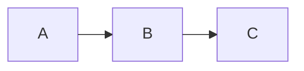

# Inkfish 🦑

シンプルで軽量な Markdown ビューアー。Tauri v2 製。

エディタは付属していません。お好きなものをお使いください。

ウィンドウは 2 種類あります。

- **単一文書ウィンドウ** — 1 ファイルを 1 窓で読む。同じファイルは常に同じ窓で開きます
- **プロジェクトウィンドウ** — フォルダを開くと、左に Markdown のツリー、右にタブが並びます

ヘッダーのタイトル部分を押すと、開いているウィンドウの一覧が出ます。
タブを持つウィンドウはその下にタブがネストして並び、選ぶとそのタブが表示されます。

対応フォーマット:

- GitHub Flavored Markdown(テーブル / タスクリスト / 脚注 / シンタックスハイライト)
- YAML フロントマター(本文冒頭のメタ情報カードとして描画)
- Mermaid(既定の dagre に加えて ELK レイアウトも利用可)
- Marp スライド(フロントマターに `marp: true`)

## プロジェクトウィンドウ

フォルダを開くと、配下の Markdown をツリーで一覧できるウィンドウになります。

```sh
inkfish docs/          # コマンド引数
```

メニューの「ファイル > フォルダを開く…」(⌘⇧O)、ウィンドウへのフォルダのドロップ、
Finder の「このアプリケーションで開く」でも開けます。

ツリーに出るのは Markdown ファイルと、それを子孫に持つディレクトリだけです。
ドット始まりのディレクトリは除外し、`.gitignore` を尊重するので `node_modules` や
`dist` は現れません。シンボリックリンクは辿りません(リンクのループ対策)。
ファイルを追加・削除・改名するとツリーは自動で追いつきます。

ツリーのファイルを押すと右にタブで開きます。すでに開いているファイルなら
そのタブに切り替わるだけで、タブが増えることはありません。本文中の Markdown への
相対リンクも、同じウィンドウのタブで開きます。

| 操作 | |
|---|---|
| ⌘W | タブを閉じる |
| ⌘⌥← / ⌘⌥→ | 前 / 次のタブ |
| ⌘1 … ⌘9 | n 番目のタブ |
| ⌘⌥B | ツリーを開閉する |

タブは掴んで並べ替えられます。ペインの幅・折りたたみとツリーの展開状態は
フォルダごとに覚えます。

### タブの切り離しと取り込み

タブをタブ列の外へ持ち出して離すと、その位置に単一文書ウィンドウとして
切り離されます。別のプロジェクトウィンドウの上で離せば、そのウィンドウの
タブになります。

逆に、単一文書ウィンドウのヘッダー(ファイル名のカプセル)を掴むと
ウィンドウ自体が動き、プロジェクトウィンドウの上で離すとそのタブとして
取り込まれます。受け入れられるときは相手のタブ列が点線で光ります。

## フロントマター

先頭の `---` … `---` は YAML として読み、本文冒頭のカードにまとめて表示します。
`title` はカードの見出しに加えて、ツールバーとウィンドウタイトルにも使われます
(ファイル名は tooltip に残ります)。

`title` / `description`・`intro`・`subtitle`・`summary` / `date`・`updated`・`author` /
`tags`・`categories`・`keywords`・`topics` は決まった位置と見せ方で描き、
それ以外のキーは書かれた順のまま `key: value` の行として並べます。
特定のスキーマに縛らないので、どんなキーでも情報が消えません。

YAML として読めなかったときは、隠さずソースのまま描いて通知します。
先頭が水平線の `---` や setext 見出しをフロントマターと読み違えることはありません。

Mermaid で ELK レイアウトを使うには、図のフロントマターで指定します:

````md

````

`layout` には `elk`(階層レイアウト)/ `elk.stress` / `elk.force` / `elk.mrtree` / `elk.sporeOverlap` が指定できます。

## コマンドライン

引数に渡した Markdown ファイルとフォルダを開きます。ファイルは 1 つ 1 ウィンドウ、
フォルダはプロジェクトウィンドウで、少しずつずらして並びます。

```sh
inkfish doc.md
inkfish docs/         # プロジェクトウィンドウ
inkfish *.md          # 全部開く(同じパスの重複は 1 つにまとめる)
inkfish docs/ memo.md # 混ぜてもよい
inkfish -- -odd.md    # -- 以降はフラグ判定をやめる
```

`-` で始まる引数は読み飛ばします。開けないパスは黙って捨てて空のウィンドウを出します。

既に Inkfish が起動している状態でコマンドを実行すると別プロセスになります
(ウィンドウ一覧は同じプロセスの窓だけを写します)。Finder のダブルクリックや
`open -a Inkfish doc.md` は従来どおり起動中のプロセスに届きます。

## 開発

```sh
npm install
npm run tauri dev
```

## ビルド

```sh
# 実行中のマシン向け
npm run tauri build

# macOS ユニバーサルバイナリ (Intel + Apple Silicon)
rustup target add aarch64-apple-darwin x86_64-apple-darwin
npm run build:mac
```

生成物は `src-tauri/target/<target>/release/bundle/` に出力されます。WebView は OS 標準のもの(WKWebView / WebView2 / WebKitGTK)を使うため、配布物は数 MB に収まります。

`v*` タグを push すると、GitHub Actions が macOS / Windows / Linux のバイナリを添付した Release を作成します。

## アーキテクチャ

描画はすべて WebView 側、Rust(`src-tauri/src/lib.rs`)側はファイル I/O・監視・
ウィンドウ管理のみを担い、Tauri の IPC で連携します。

WebView 側は「中身」と「ガワ」に分かれています。ガワはウィンドウの形式ごとに
別のページで、中身はどちらにも同じものが載ります。

| | |
|---|---|
| `src/viewer/` | 中身。`DocumentViewer` が container を受け取り、本文・スライド・図の拡大表示の DOM を自分で組む。Markdown 描画・Mermaid・Marp・front matter・ページ内検索を持つ |
| `src/chrome/` | ガワの共通部品。ウィンドウ 1 つに 1 つあるもの(検索バー・設定・トースト・ウィンドウ切替・PDF 書き出し・ファイル I/O・ウィンドウのドラッグ) |
| `src/shell/` | 単一文書ウィンドウのガワ(`index.html` + `AppShell`) |
| `src/project/` | プロジェクトウィンドウのガワ(`project.html` + `ProjectShell` + ツリー + タブ)。タブごとに `DocumentViewer` を 1 つ持つ |
| `src/styles/` | `tokens.css`(トークン)/ `viewer.css`(中身)/ `chrome.css`(共通部品)/ `shell.css`・`project.css`(ガワごと) |

依存は「ガワ → 中身」の一方通行です。中身はガワを知らず、必要な通知は
コールバック(`onCaption` / `onNotice` / `onProgress` / `onFindUpdate` /
`onLinkActivate`)で返します。Tauri にも依存せず、相対パス画像の URL 変換は
`resolveAsset` として注入されます。

そのため中身だけを別の形式のウィンドウに載せられます。ガワは
「窓の形式ごとに変わる部分」なので、実行時に切り替えるのではなくページを
分けてあります(`vite.config.ts` の 2 エントリ)。新しい形式を足すときは、
自分の HTML に自分のガワを書いて `DocumentViewer` をマウントし、
`tokens.css` + `viewer.css` を読めば動きます。ツールバー分の上端の逃げは
`--ink-chrome-top` で受け渡すので、ガワの無い窓では 0 になります。
Rust 側の `capabilities/default.json` の `windows` に、新しいラベルの
パターンを足すのを忘れないこと(忘れると `invoke` も `listen` も全部拒否されます)。

### ひとつの document に中身を複数載せるとき

タブごとに `DocumentViewer` を持つため、共有ライブラリのシングルトンが
衝突しないようにしてあります。

- **Mermaid** — 描画はモジュールレベルのキューで直列化しています。
  `deterministicIds` の連番と `initialize()` のテーマ設定はライブラリ全体で
  1 本しかないので、同時に描くと id を取り違えて図が空になります
- **ページ内検索** — `CSS.highlights` のハイライト名はインスタンスごとの連番で、
  対応する `::highlight()` 規則は実行時に生成します
- **Marp** — `browser()` の戻り値は最初の container に束縛されるので、
  ハンドルはインスタンスごとに持ちます
- **見出し・脚注の id** — `idPrefix` オプションで名前空間を分けます
  (既定は前置きなしなので、単一文書ウィンドウの id は素のままです)
- **非アクティブなタブ** — `setFrozen()` で凍結し、テーマ切替でタブの数だけ
  再描画が走らないようにしています

### ウィンドウをまたぐタブの受け渡し

macOS の `performWindowDragWithEvent:` は投げっぱなしで、どこで離したかを
アプリに知らせる手段がありません(Tauri / tao / NSWindow デリゲートのどこにも
ドラッグ終了イベントが無く、ドラッグ中の NSWindow はドラッグペーストボードにも
何も載せないので受け側にも届きません)。そのためドラッグは自前で持っています
(`src/chrome/windowdrag.ts`)。

前提として実測したこと:

- `pointermove` / `pointerup` はウィンドウの矩形外でも届き、client 座標は
  窓のサイズを超えて伸びる
- `event.screenX` / `screenY` はデスクトップ座標として正しい。一方
  `window.screenX` は当てにならないので、窓の原点は `screenX - clientX` で求める
- `<button>` や `role="tab"` の上では、Tauri のドラッグ領域も AppKit の
  タイトルバードラッグも発生しない(ウィンドウ上端でも効く)

ウィンドウの生成・移動・破棄はすべて Rust コマンド経由なので、
`capabilities` に `allow-create` / `allow-close` / `allow-set-position` は
要りません。

## ライセンス

[MIT](LICENSE)
