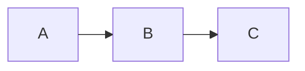

# Inkfish 🦑

シンプルで軽量な Markdown ビューアー。Tauri v2 製。

エディタは付属していません。お好きなものをお使いください。

同じファイルは常に同じウィンドウで開き、ヘッダーのファイル名の右にある
キャレットから、開いているウィンドウを一覧・切り替えできます。

対応フォーマット:

- GitHub Flavored Markdown(テーブル / タスクリスト / 脚注 / シンタックスハイライト)
- YAML フロントマター(本文冒頭のメタ情報カードとして描画)
- Mermaid(既定の dagre に加えて ELK レイアウトも利用可)
- Marp スライド(フロントマターに `marp: true`)

## フロントマター

先頭の `---` … `---` は YAML として読み、本文冒頭のカードにまとめて表示します。
`title` はカードの見出しに加えて、ツールバーとウィンドウタイトルにも使われます
(ファイル名は tooltip に残ります)。

`title` / `description`・`intro`・`subtitle`・`summary` / `date`・`updated`・`author` /
`tags`・`categories`・`keywords`・`topics` は決まった位置と見せ方で描き、
それ以外のキーは書かれた順のまま `key: value` の行として並べます。
特定のスキーマに縛らないので、どんなキーでも情報が消えません。

YAML として読めなかったときは、隠さずソースのまま描いて通知します。
先頭が水平線の `---` や setext 見出しをフロントマターと読み違えることはありません。

Mermaid で ELK レイアウトを使うには、図のフロントマターで指定します:

````md

````

`layout` には `elk`(階層レイアウト)/ `elk.stress` / `elk.force` / `elk.mrtree` / `elk.sporeOverlap` が指定できます。

## コマンドライン

引数に渡した Markdown ファイルを開きます。複数渡すと 1 ファイル 1 ウィンドウで
少しずつずらして並びます。

```sh
inkfish doc.md
inkfish *.md          # 全部開く(同じファイルの重複は 1 つにまとめる)
inkfish -- -odd.md    # -- 以降はフラグ判定をやめる
```

`-` で始まる引数は読み飛ばします。開けないパスは黙って捨てて空のウィンドウを出します。

既に Inkfish が起動している状態でコマンドを実行すると別プロセスになります
(ウィンドウ一覧は同じプロセスの窓だけを写します)。Finder のダブルクリックや
`open -a Inkfish doc.md` は従来どおり起動中のプロセスに届きます。

## 開発

```sh
npm install
npm run tauri dev
```

## ビルド

```sh
# 実行中のマシン向け
npm run tauri build

# macOS ユニバーサルバイナリ (Intel + Apple Silicon)
rustup target add aarch64-apple-darwin x86_64-apple-darwin
npm run build:mac
```

生成物は `src-tauri/target/<target>/release/bundle/` に出力されます。WebView は OS 標準のもの(WKWebView / WebView2 / WebKitGTK)を使うため、配布物は数 MB に収まります。

`v*` タグを push すると、GitHub Actions が macOS / Windows / Linux のバイナリを添付した Release を作成します。

## アーキテクチャ

描画はすべて WebView 側、Rust(`src-tauri/src/lib.rs`)側はファイル I/O・監視・ウィンドウ管理のみを担い、Tauri の IPC で連携します。

WebView 側は「中身」と「ガワ」に分かれています。

| | |
|---|---|
| `src/viewer/` | 中身。`DocumentViewer` が container を受け取り、本文・スライド・図の拡大表示の DOM を自分で組む。Markdown 描画・Mermaid・Marp・front matter・ページ内検索を持つ |
| `src/shell/` | ガワ。`AppShell` がツールバー・空の状態・検索バー・設定・トーストと、ファイル I/O・監視・PDF 書き出し・メニュー配線を持ち、中身を内部で生成する |
| `src/styles/` | `tokens.css`(デザイントークン)/ `viewer.css`(中身)/ `shell.css`(ガワ) |

依存は「ガワ → 中身」の一方通行です。中身はガワを知らず、必要な通知は
コールバック(`onCaption` / `onNotice` / `onProgress` / `onFindUpdate` /
`onLinkActivate`)で返します。Tauri にも依存せず、相対パス画像の URL 変換は
`resolveAsset` として注入されます。

そのため、中身だけを別の形式のウィンドウに載せられます。ガワは
「窓の形式ごとに変わる部分」なので markup は `index.html` に置いてあり、
別形式の窓は自分の HTML に自分のガワを書いて `DocumentViewer` を
マウントし、`tokens.css` + `viewer.css` を読めば動きます。ツールバー分の
上端の逃げは `--ink-chrome-top` で受け渡すので、ガワの無い窓では 0 になります。

現状は 1 ウィンドウ 1 インスタンス前提です。ひとつの document に
`DocumentViewer` を 2 つ以上並べるなら、Mermaid の連番 id
(`deterministicIds`)・`CSS.highlights` のハイライト名の 2 つが
インスタンス間で衝突するので、そこを名前空間で分ける必要があります。

## ライセンス

[MIT](LICENSE)
